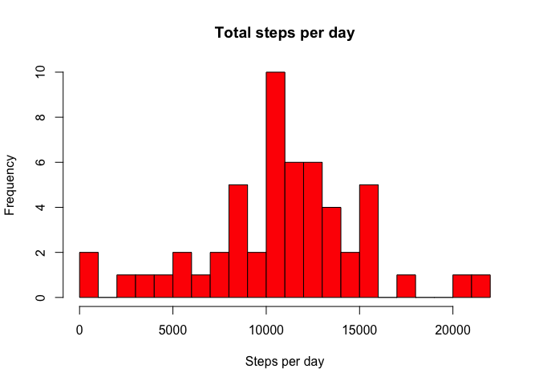
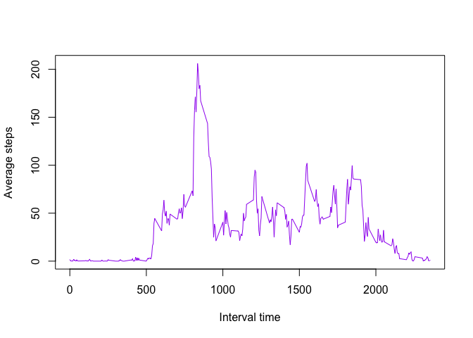
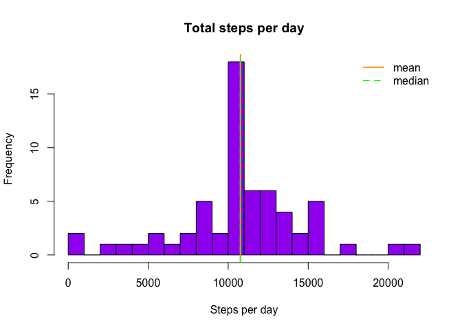
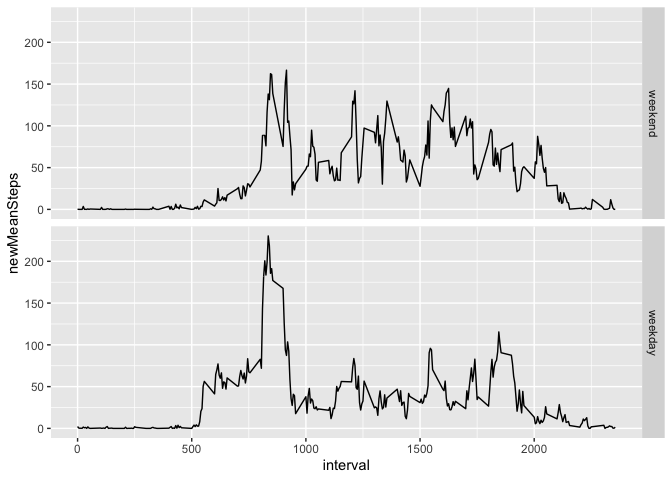

## Loading and preprocessing the data

```r
unzip("activity.zip")
activity <- read.csv("activity.csv")
str(activity)
```

```
## 'data.frame':	17568 obs. of  3 variables:
##  $ steps   : int  NA NA NA NA NA NA NA NA NA NA ...
##  $ date    : Factor w/ 61 levels "2012-10-01","2012-10-02",..: 1 1 1 1 1 1 1 1 1 1 ...
##  $ interval: int  0 5 10 15 20 25 30 35 40 45 ...
```

```r
cleanedActivity <- activity[which(!is.na(activity$steps)),]
```


## What is mean total number of steps taken per day?

### 1. Calculate the total number of steps taken per day

```r
stepsByDay <- aggregate(cleanedActivity$steps, by = list(date = cleanedActivity$date), FUN = sum)
head(stepsByDay)
```

```
##         date     x
## 1 2012-10-02   126
## 2 2012-10-03 11352
## 3 2012-10-04 12116
## 4 2012-10-05 13294
## 5 2012-10-06 15420
## 6 2012-10-07 11015
```

```r
require(dplyr)
```

```
## Loading required package: dplyr
```

```
## 
## Attaching package: 'dplyr'
```

```
## The following objects are masked from 'package:stats':
## 
##     filter, lag
```

```
## The following objects are masked from 'package:base':
## 
##     intersect, setdiff, setequal, union
```

```r
stepsByDay <- stepsByDay %>% rename(steps = x)
```

####  2. Make a histogram of the total number of steps taken each day

```r
class(stepsByDay$steps)
```

```
## [1] "integer"
```

```r
hist(as.numeric(stepsByDay$steps), main = "Total steps per day", xlab = "Steps per day", col = "red", breaks = 20)
```

<!-- -->

#### 3. Calculate and report the mean and median of the total number of steps taken per day

```r
meanStepsPerDay <- mean(stepsByDay$steps)
meanStepsPerDay
```

```
## [1] 10766.19
```

```r
medianStepsPerDay <- median(stepsByDay$steps)
medianStepsPerDay
```

```
## [1] 10765
```


## What is the average daily activity pattern?

### 1. Make a time series plot (i.e type="l") of the 5-minute interval (x-axis) and the average number of steps taken, averaged across all days (y-axis)

```r
meanStepsByInterval <- aggregate(cleanedActivity$steps, by = list(interval = cleanedActivity$interval), FUN = mean)
head(meanStepsByInterval)
```

```
##   interval         x
## 1        0 1.7169811
## 2        5 0.3396226
## 3       10 0.1320755
## 4       15 0.1509434
## 5       20 0.0754717
## 6       25 2.0943396
```

```r
plot(meanStepsByInterval$interval, meanStepsByInterval$x, ty = "l", xlab = "Interval time", ylab = "Average steps", col = "purple" )
```

<!-- -->

### 2. Which 5-minute interval, on average across all the days in the dataset, contains the maximum number of steps?

```r
maxMeanStepsByInterval <- meanStepsByInterval$interval[which.max(meanStepsByInterval$x)]
maxMeanStepsByInterval
```

```
## [1] 835
```

## Imputing missing values

### 1. Calculate and report the total number of missing values in the dataset (i.e. the total number of rows with NAs)

```r
nrow(activity[which(is.na(activity$steps)),])
```

```
## [1] 2304
```

### 2. Devise a strategy for filling in all of the missing values in the dataset. The strategy does not need to be sophisticated. For example, you could use the mean/median for that day, or the mean for that 5-minute interval, etc.

I will fill in the missing values with the average of each particular interval where the value is missing

### 3. Create a new dataset that is equal to the original dataset but with the missing data filled in.


```r
noNAs <- numeric(nrow(activity))
for (i in 1:nrow(activity)) {
  if(is.na(activity[i, "steps"]) == TRUE) {
    noNAs[i] <- filter(meanStepsByInterval, interval == activity[i, "interval"]) %>% select(x)
  }
  else {
    noNAs[i] <- activity[i, "steps"]
  }
}

head(noNAs)
```

```
## [[1]]
## [1] 1.716981
## 
## [[2]]
## [1] 0.3396226
## 
## [[3]]
## [1] 0.1320755
## 
## [[4]]
## [1] 0.1509434
## 
## [[5]]
## [1] 0.0754717
## 
## [[6]]
## [1] 2.09434
```

```r
activity$newSteps = noNAs
head(activity)
```

```
##   steps       date interval  newSteps
## 1    NA 2012-10-01        0  1.716981
## 2    NA 2012-10-01        5 0.3396226
## 3    NA 2012-10-01       10 0.1320755
## 4    NA 2012-10-01       15 0.1509434
## 5    NA 2012-10-01       20 0.0754717
## 6    NA 2012-10-01       25   2.09434
```

### 4. Make a histogram of the total number of steps taken each day and Calculate and report the mean and median total number of steps taken per day. Do these values differ from the estimates from the first part of the assignment? What is the impact of imputing missing data on the estimates of the total daily number of steps?

```r
newStepsByDay <- aggregate(as.numeric(activity$newSteps), by = list(date = activity$date), FUN = sum)
newStepsByDay <- newStepsByDay %>% rename(newSteps = x)
head(newStepsByDay)
```

```
##         date newSteps
## 1 2012-10-01 10766.19
## 2 2012-10-02   126.00
## 3 2012-10-03 11352.00
## 4 2012-10-04 12116.00
## 5 2012-10-05 13294.00
## 6 2012-10-06 15420.00
```

```r
hist(newStepsByDay$newSteps, main = "Total steps per day", xlab = "Steps per day", col = "purple", breaks = 20)
abline(v = mean(newStepsByDay$newSteps), lty = 1, lwd = 2, col = "orange")
abline(v=median(newStepsByDay$newSteps),lty=2, lwd=2, col="green")
legend(legend= c("mean", "median"),col = c("orange", "green"),"topright",lty= c(1, 2),lwd=2,bty = "n")
```

<!-- -->

```r
mean(newStepsByDay$newSteps)
```

```
## [1] 10766.19
```

```r
median(newStepsByDay$newSteps)
```

```
## [1] 10766.19
```


## Are there differences in activity patterns between weekdays and weekends?

### 1. Create a new factor variable in the dataset with two levels – “weekday” and “weekend” indicating whether a given date is a weekday or weekend day.

```r
library(lubridate)
```

```
## 
## Attaching package: 'lubridate'
```

```
## The following objects are masked from 'package:dplyr':
## 
##     intersect, setdiff, union
```

```
## The following objects are masked from 'package:base':
## 
##     date, intersect, setdiff, union
```

```r
typeOfDay <- function(date) {
  if(wday(date) %in% c(1,7)) 
    result <- "weekend"
  else
    result <- "weekday"
  result
}

activity <- mutate(activity, date=ymd(date)) %>% mutate(day = sapply(date, typeOfDay))
```

### 2. Make a panel plot containing a time series plot (i.e. \color{red}{\verb|type = "l"|}type="l") of the 5-minute interval (x-axis) and the average number of steps taken, averaged across all weekday days or weekend days (y-axis). See the README file in the GitHub repository to see an example of what this plot should look like using simulated data.

```r
library(ggplot2)
newMeanStepsByInterval <- activity %>% mutate(day=factor(day,levels=c("weekend","weekday")), newSteps=as.numeric(newSteps)) %>% group_by(interval,day) %>% summarise(newMeanSteps = mean(newSteps))
qplot(interval, newMeanSteps, data = newMeanStepsByInterval, geom = "line", facets = day~.)
```

<!-- -->
